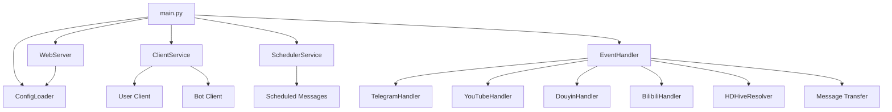

# Architecture

## Component Overview

## Key Components

### Web Config Manager (`src/web/`)
- `web_server.py`: FastAPI application factory and server runner
- `config_api.py`: REST API endpoints for loading and saving `config.yaml`
- `web/`: Static assets for the configuration dashboard

### ClientService (`src/services/client_service.py`)
- Manages Telegram client lifecycle
- Creates bot and/or user client based on config
- Handles proxy configuration
- Methods: `start_user_client()`, `start_bot_client()`, `disconnect_all()`

### EventHandler (`src/handlers/event_handler.py`)
- Central event routing hub
- Registers handlers on Telegram clients
- Delegates to platform-specific handlers based on message content
- Handles permission checks via `is_chat_allowed()`

### Platform Handlers

| Handler | File | Purpose |
|---------|------|---------|
| TelegramHandler | `handlers/telegram_handler.py` | Downloads media from Telegram messages |
| YouTubeHandler | `handlers/youtube_handler.py` | Downloads YouTube videos via yt-dlp |
| DouyinHandler | `handlers/douyin_handler.py` | Downloads Douyin videos |
| BilibiliHandler | `handlers/bilibili_handler.py` | Downloads Bilibili videos |
| HDHiveResolver | `handlers/hdhive_handler.py` | Resolves HDHive links via server-action + go-api flow |

### SchedulerService (`src/services/scheduler_service.py`)
- Uses APScheduler for scheduling
- Sends messages at configured times
- Requires user client (not bot client)

## Message Flow

1. **Incoming Message** → Bot/User client receives event
2. **EventHandler.handle_message** → Routes based on content
3. **URL Detection** → Matches YouTube/Bilibili/Douyin patterns
4. **Handler Processing** → Downloads media to temp, moves to destination
5. **Response** → Sends confirmation/file back to user

## Data Flow

### Configuration
`config/config.yaml` → `load_config()` → Dict passed to all services

### File Storage
- Temp files: `temp/{platform}/`
- Final files: `downloads/{platform}/`
- Telegram files sorted by type: `videos/`, `audios/`, `photos/`, `others/`

### Message Transfer Flow
1. Source channel message received by user client
2. Keyword filtering (include/exclude) applied
3. Link filtering (forwardIgnoreLink) applied  
4. Message forwarded to target chat

### HDHive Resolution Flow
1. `EventHandler` detects HDHive links and delegates to `HDHiveResolver`.
2. Resolver opens resource page directly with persisted cookie.
3. If auth is missing/expired, resolver performs server-action login and refreshes cookie.
4. Resolver tries direct 115 link extraction from page response.
5. If no direct link, resolver encrypts query payload, calls go-api URL endpoint, and decrypts returned data.
6. If unlock is required and points are below threshold, resolver calls unlock endpoint and retries until final 115 link is obtained.
